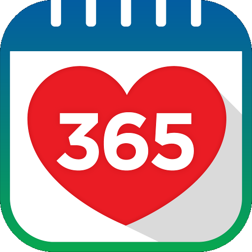

    

      

## Members
| Team Members         | Email                           | Track                             |
| :------------------: | :-----------------------------: | :-------------------------------: |
| Low Tze Ern Rachel   | rachel.low.2021@scis.smu.edu.sg | Business Analytics                |
| Ng Jun Yang          | junyang.ng.2021@scis.smu.edu.sg | Business Analytics                |
| Xu Xinhui            | xinhui.xu.2021@scis.smu.edu.sg  | Digitalisation & Cloud Solutions  |
| Koo Jie Yin          | jieyin.koo.2021@scis.smu.edu.sg | Digitalisation & Cloud Solutions  |
| Danelle Goh Ruoqing  | danellegoh.2021@scis.smu.edu.sg | Digitalisation & Cloud Solutions  |

## Project Overview
Healthy 365 is a mobile application that helps resident to discover and access healthy lifestyle offerings that will help them to achieve their health goals. In our project, we have conducted a study on youth's health tracking behaviour and preferences, and have also created a prototype of Healthy 365 targeted at youths aged 13 to 17 years old.

### Features
The key features of our application are
1. <b>Gamified Experience</b>: UI/UX designed and engineered to drive app usage.
2. <b>Non-Monetary Rewards</b>: Gamification of application including Card Collection, Trading, and Streaks.
3. <b>Advanced Analytics</b>: Utilise machine learning models such as clustering techniques to analyse users based on their behaviour to improve event’s signup rate and efficacy of app.
4. <b>Personalised Feedback</b>: Personalised event recommendations to create a more relevant user experience.

## Tech Stack
### Frontend

### Backend

### Database

### Deployment

## Setup and Instalaltion
To install and run the app, run the following command after you have downloaded the application
1. Run MAMP / WAMP
2. Global search and replace database URI as required
3. Import csv files to local SQL server 
4. Run the application
    - On Windows
        1. Open your preferred terminal.
        2. Navigate to the `IS483` directory:
            - cd path\to\IS483
        3. Execute the provided `run.bat` script:
            - .\run.bat
    - On Mac/Linux
        1. Open your preferred terminal.
        2. Navigate to the `IS483` directory:
            - cd path/to/IS483/
        3. To give permission for the `run_utils.sh` script to be executed, run the following command:
            - chmod +x run_utils.sh
        4. Execute the provided `run_utils.sh` script:
            - ./run_utils.sh
  

